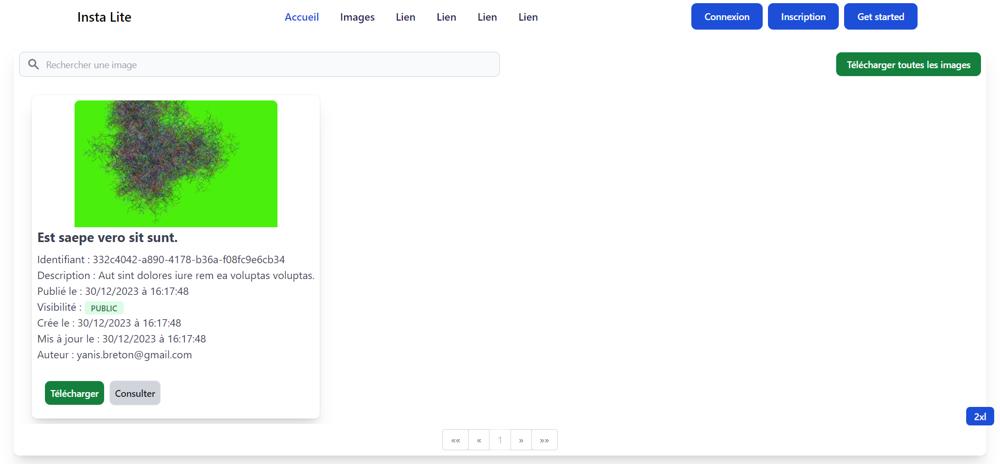
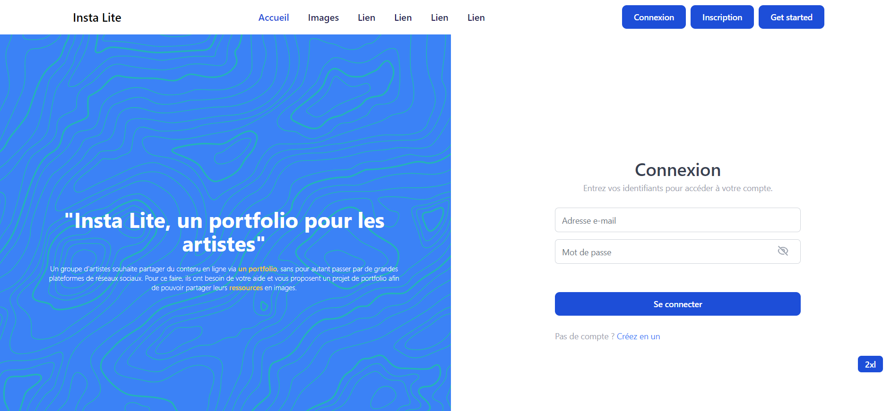
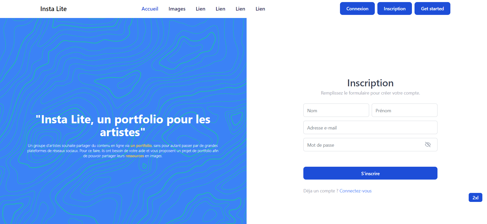
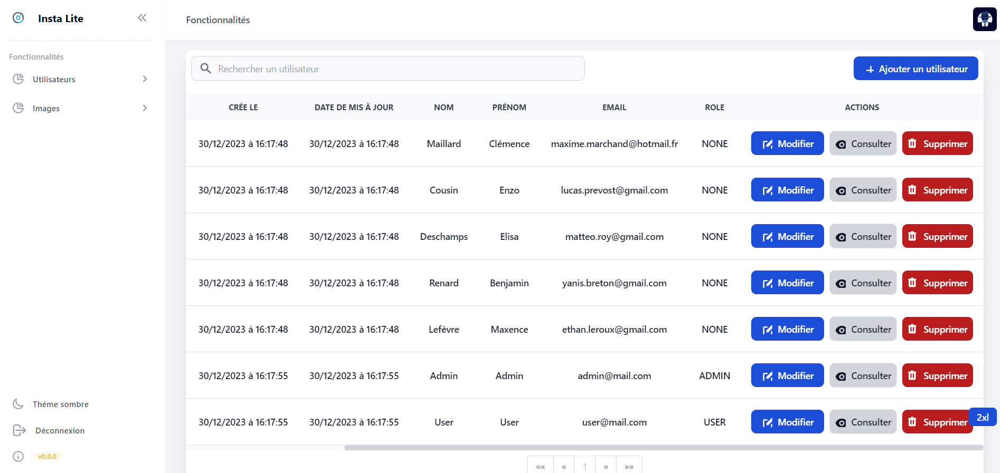
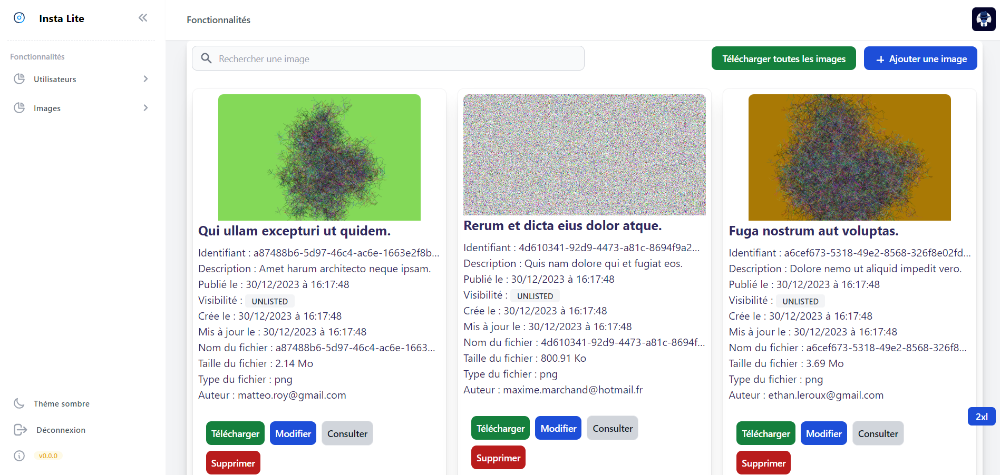
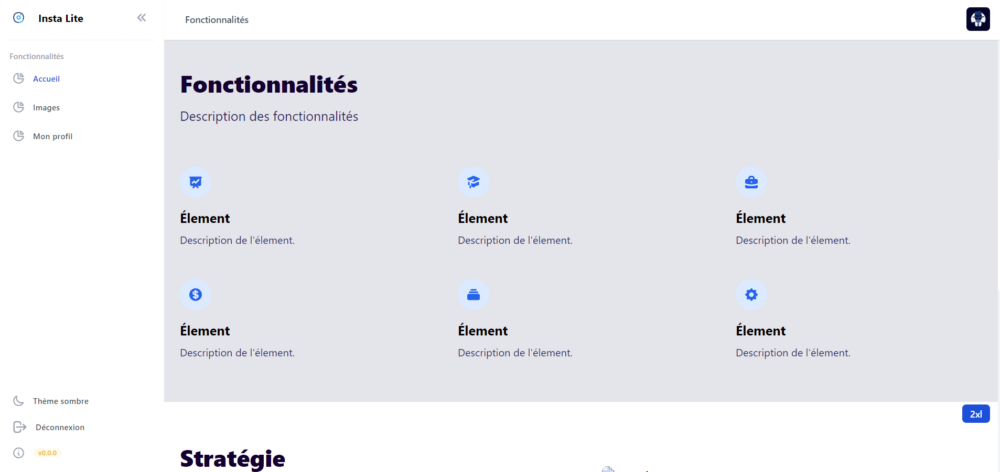
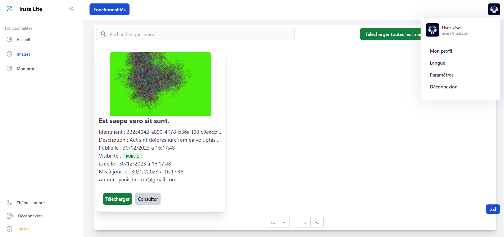
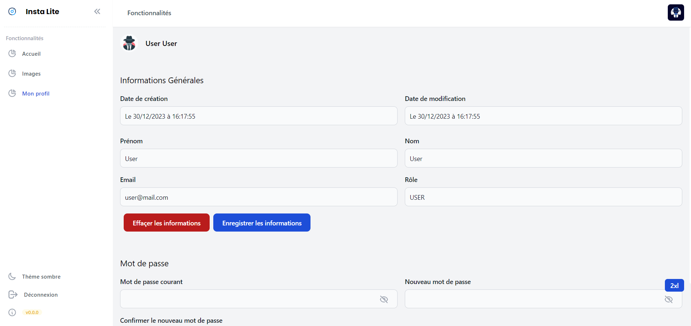
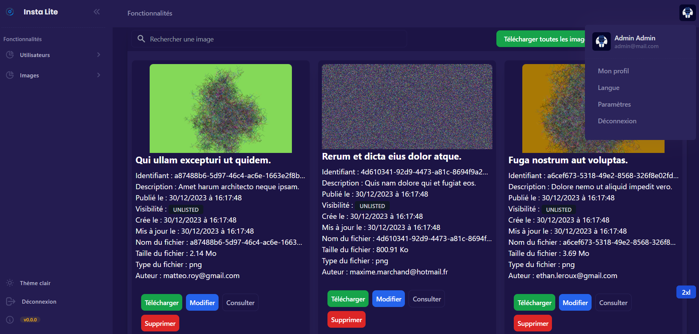
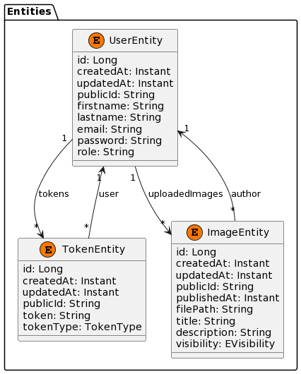

# Insta Lite (Back-end)

# Présentation

**Insta Lite (Back-end)** est [API](https://fr.wikipedia.org/wiki/API) [REST](https://fr.wikipedia.org/wiki/Representational_state_transfer) qui permet la gestion d'images en ligne.

## Authentification

Au démarrage de l'application, deux comptes sont créés pour faciliter le processus d'authentification.
Ces comptes sont définis dans la méthode `commandLineRunner` de la classe `InstaliteApplication` situé dans le répertoire 
`src/main/java/fr/instalite`.

Compte administrateur :
- **Email:** ```admin@mail.com```
- **Mot de passe:** ```Admin123456$```

Compte utilisateur :
- **Email:** ```user@mail.com```
- **Mot de passe:** ```User123456$```

## Prévisualisation

Le front-end est situé dans le dépôt insta_lite_Front_End dont voici quelques prévisualisations.











### Installation

# Technologies

Pour ces technologies, vous devez installer ces versions (pour le local) ou docker (qui sont directement intégrés) :
- Java 17
- Maven : Apache Maven 3.9.3
- Spring Boot 3.1.4

# Modèle Conceptuel de données

Réalisé sous PlantUML : https://www.plantuml.com/



# Configuration du fichier d'environnement (.env)

Afin d'utiliser l'application, il y a deux modes d'utilisations, soit en ayant les outils installées sur sa machine ou soit en utilisant docker, le fichier `.env` doit être adapter en fonction de votre mode d'utilisation:
En local :
```shell
SPRING_HOST=127.0.0.1
POSTGRES_HOST=127.0.0.1
ADMINER_HOST=127.0.0.1
```
Avec docker :
```
SPRING_HOST=0.0.0.0
POSTGRES_HOST=0.0.0.0 
ADMINER_HOST=0.0.0.0
```

# Base de données

## En locale (Sans Docker)

- Outils à installer :
# Installation sans Docker

1. **Java Development Kit (JDK) :**
   - Vous avez besoin du kit de développement Java installé sur votre système pour compiler et exécuter des applications Java.
   - Téléchargez et installez la dernière version du JDK à partir du [site officiel d'Oracle](https://www.oracle.com/java/technologies/javase-downloads.html) ou choisissez une version open-source comme OpenJDK.

2. **Spring Boot : 3.1.4**
   - Spring Boot simplifie le développement d'applications Java. Vous pouvez l'obtenir en ajoutant les dépendances Spring Boot à votre projet ou en téléchargeant l'interface de ligne de commande Spring Boot (Spring Boot CLI).
   - Vous pouvez ajouter les dépendances Spring Boot en les configurant dans vos fichiers de construction Maven ou Gradle.

3. **Apache Maven :**
   - Apache Maven est un outil d'automatisation de construction utilisé pour gérer les dépendances du projet et le cycle de vie de la construction. Il est couramment utilisé avec les projets Java.
   - Vous pouvez télécharger et installer Maven depuis le [site officiel d'Apache Maven](https://maven.apache.org/download.cgi).

4. **Base de données PostgreSQL :**
   - PostgreSQL est un puissant système de gestion de base de données relationnelle open-source. Vous en aurez besoin pour stocker les données de votre application.
   - Vous pouvez télécharger et installer PostgreSQL depuis le [site officiel de PostgreSQL](https://www.postgresql.org/download/).

5. **Adminer (facultatif) :**
   - Adminer est un outil léger de gestion de base de données qui peut vous aider à interagir avec votre base de données PostgreSQL. Il s'agit d'un outil facultatif mais peut être très utile pendant le développement.
   - Vous pouvez installer Adminer en extrayant l'image Docker officielle et en l'exécutant en tant que conteneur. Plus de détails sont disponibles [ici](https://hub.docker.com/_/adminer).

Les variables d'environnement dans le fichier .env sont les mêmes, ce qui vous permet de choisir entre une utilisation locale avec les outils PostgreSQL, Spring, etc. installés sur votre machine, ou une utilisation avec Docker.

Assurez-vous d'avoir PostgreSQL installé et d'avoir ajouté PostgreSQL à votre variable d'environnement PATH.
Vous pouvez maintenant démarrer le serveur en suivant ces étapes :

```bash
pg_ctl start -D "D:\PostgreSQL\data"
```
Le D:\PostgreSQL\data est le répertoire des données, il est souvent définit par la variable d'environnement PGDATA.
Vous devez adapter le chemin si celui-ci ne correspond pas.

Pour arrêter le serveur :
```bash
pg_ctl stop -D "D:\PostgreSQL\data"
```

Avec le compte par défaut (postgres), vous devez commençer par crée l'utilisateur user_insta_lite ainsi que sa base de données :
```bash
psql -U postgres -h 127.0.0.1 -p 5432
```
```sql
postgres=# <commande>
```
Maintenant, vous êtes connecté avec l'utilisateur postgres, vous pouvez entrer votre commande SQL.

```sql
CREATE USER user_insta_lite WITH PASSWORD 'user_insta_lite';
```

```sql
ALTER USER user_insta_lite WITH SUPERUSER;
```

```sql
CREATE DATABASE insta_lite;
```
```sql
\q
```
```sql
psql -U user_insta_lite -d insta_lite
```

Se connecter à l'utilisateur crée et créer la base de données.
```bash
psql -U <username> -d <database> -h <hostname or IP> -p <port>
```
```bash
psql -U user_insta_lite -d insta_lite -h 127.0.0.1 -p 5432
```
```sql
CREATE DATABASE insta_lite;
```

Lancement de l'application :
```bash
cd insta_lite_back_end
```
```bash
mvn spring-boot:run
```

# Installation avec Docker

Avant de commencer, assurez-vous que le client PostgreSQL est fermé sur votre machine, car il pourrait bloquer l'utilisation de certains ports utilisés par Docker.

### Étape 1 : Compilation et création du JAR

Pour construire le JAR de l'application, suivez ces étapes :

1. Ouvrez un terminal.
2. Assurez-vous qu'il n'y a pas d'erreurs dans le code.
   ```shell
   ./mvnw compile
   ```

3. Créez le JAR en exécutant la commande suivante. Le JAR généré sera utilisé dans le fichier Dockerfile.
   ```shell
   ./mvnw clean package -DskipTests
   ```

### Étape 2 : Build et démarrage des conteneurs Docker

Pour construire et démarrer les conteneurs Docker, exécutez la commande suivante :

```shell
docker-compose up --build
```

Pour arrêter les conteneurs Docker, exécutez la commande suivante :
```shell
docker-compose up --build
```

Après l'exécution de cette commande, les conteneurs suivants seront démarrés :

- Spring Boot 3.1.4 : [http://localhost:8080/](http://localhost:8080/)
- PostgreSQL : Port 5432
- Adminer : [http://localhost:8081/](http://localhost:8081/)

**Adminer** est disponible à l'adresse [http://localhost:8081/](http://localhost:8081/). Assurez-vous que PostgreSQL est en cours d'exécution pour utiliser Adminer.

Voici les informations de connexion pour Adminer :
- Système : PostgreSQL
- Serveur : localhost
- Nom d'utilisateur : user_insta_lite
- Mot de passe : user_insta_lite

Si vous avez Docker, veuillez fermer Docker ou arrêter les conteneurs qui pourraient utiliser les mêmes ports.

Informations supplémentaires :
Veuillez noter que la variable ```SPRING_DATASOURCE_URL``` est écrasée :
Lorsque l'application s'exécute dans un environnement Docker, elle utilise la valeur spécifiée dans le fichier compose.yml pour SPRING_DATASOURCE_URL, qui est ensuite récupérée dans le fichier application.properties.
En revanche, lorsque l'application est exécutée localement, c'est-à-dire sans Docker, elle utilise directement la valeur définie dans le fichier .env pour SPRING_DATASOURCE_URL, qui est ensuite intégrée dans le fichier application.properties.

Pour remplir le tableau des endpoints en utilisant les controllers User, Token, Image et Video, nous devons examiner chaque méthode dans ces contrôleurs et extraire les informations nécessaires. Voici un tableau avec les informations demandées :

## Swagger

Le Swagger est disponible ici à ces deux addresses : 
http://localhost:8080/swagger-ui/index.html
http://localhost:8080/instalite-documentation

## Endpoints

| Controller             | Full Endpoint                                   | HTTP Method | Parameters                   | Body                 |
|------------------------|-------------------------------------------------|-------------|------------------------------|----------------------|
| AuthenticationController | /api/insta_lite/authentication/register        | POST        | -                            | RegisterRequest      |
| AuthenticationController | /api/insta_lite/authentication/authenticate    | POST        | -                            | AuthenticationRequest |
| AuthenticationController | /api/insta_lite/authentication/refresh-token   | POST        | -                            | -                    |
| UserController         | /api/insta_lite/users/{id}                      | GET         | id: Long                     | -                    |
| UserController         | /api/insta_lite/users/{public_id}               | GET         | public_id: String            | -                    |
| UserController         | /api/insta_lite/users/all                       | GET         | -                            | -                    |
| UserController         | /api/insta_lite/users                           | GET         | sortBy: String, sortOrder: String, pageable: Pageable | - |
| UserController         | /api/insta_lite/users                           | POST        | -                            | UserCreateRequest    |
| UserController         | /api/insta_lite/users/{public_id}               | PUT         | public_id: String            | UserUpdateRequest    |
| UserController         | /{public_id}/profile                            | PATCH       | -                            | UserProfileUpdateRequest |
| UserController         | /{public_id}/change-password                    | POST        | -                            | UserChangePasswordRequest |
| UserController         | /api/insta_lite/users/{public_id}               | DELETE      | public_id: String            | -                    |
| UserController         | /api/insta_lite/users/all                       | DELETE      | -                            | -                    |
| ImageController        | /api/insta_lite/images/{id}                     | GET         | id: Long                     | -                    |
| ImageController        | /api/insta_lite/images/{public_id}              | GET         | public_id: String            | -                    |
| ImageController        | /api/insta_lite/images                          | GET         | -                            | -                    |
| ImageController        | /api/insta_lite/images                          | POST        | -                            | ImageCreateRequest   |
| ImageController        | /api/insta_lite/images/{public_id}              | PUT         | public_id: String            | ImageUpdateRequest   |
| ImageController        | /api/insta_lite/images/{public_id}              | DELETE      | public_id: String            | -                    |

# Problèmes rencontrés

CONTEXT :
Dans le fichier `application.properties`, j'avais configuré le `server.servlet.context-path=/api`. Cependant, dans le filtre `JwtAuthenticationFilter`, j'effectuais un test qui ne prenait pas en compte le `/api`. De même, dans la configuration de la sécurité (`SecurityConfiguration`), j'avais ajouté le préfixe `/api` à toutes les URL. Cependant, le contexte de la servlet avait déjà comme préfixe `/api`, ce qui entraînait des incohérences dans les chemins.
J'ai résolu ce problème en laissant le contexte de la servlet à `/` dans le fichier `application.properties` :
```properties
server.servlet.context-path=/
```
Ainsi, toutes les requêtes n'ont plus besoin du préfixe `/api`. J'ai également mis à jour toutes les références aux chemins dans les filtres, les annotations de contrôleur, etc., pour qu'elles correspondent correctement à la nouvelle configuration du contexte de servlet.

Source Upload Multipart :
https://stackoverflow.com/questions/21329426/spring-mvc-multipart-request-with-json/25183266#25183266

### Améliorations


#### Refactoring de l'entité Image

- L'utilisation d'un UUID en clé primaire pour les entités au lieu d'une string publicId
@Id
@GeneratedValue(strategy = GenerationType.UUID)
@Column(name = "id", updatable = false, nullable = false)
private UUID id;

Par exemple, si on ajoute la possibilité d'uploader Video, alors regroupe Image et Video dans une classe mère et faire hérité
car ceux sont juste des uploads de fichier, juste le type qui change

Par exemple, supposons que nous souhaitions introduire la possibilité d'uploader des vidéos. Dans ce cas, nous pourrions créer une classe parente commune appelée, par exemple, "MediaEntity", et faire hériter les classes "ImageEntity" et "VideoEntity" de cette classe. Ainsi, bien que nous ayons deux types d'uploads différents (images et vidéos), ils partageraient des caractéristiques communes, car ce sont essentiellement des opérations d'upload de fichiers avec une distinction sur le type de média.

#### Architecture

- Clean Architecture : https://www.baeldung.com/spring-boot-clean-architecture
- Hexagone Architecture : https://www.youtube.com/watch?v=e3K0_URBxRI&pp=ygUlaGV4YWdvbmUgYXJjaGl0ZWN0dXJlIGNvZGV1ciBlbiBzZWluZQ%3D%3D

#### Versionning de l'API

Source : https://stackoverflow.com/questions/389169/best-practices-for-api-versioning

#### Scalabilité

Ici, nous avons pas envisagé une quantité de données importantes,
et dans les sous attributs, nous pourrions avoir de la pagination
en plus de celle ajouter sur les 

#### Cache

La mise en place d'un cache pour les données statiques :
- https://spring.io/guides/gs/caching/
- https://www.baeldung.com/spring-cache-tutorial

#### Rate limiter

La mise en place d'un contrôle de débit sur les endpoints de l'API.
- https://www.baeldung.com/spring-bucket4j
- https://spring.io/blog/2021/04/05/api-rate-limiting-with-spring-cloud-gateway

#### Profiles

L'utilisation de différents profil pour le développement, le test et la production :
- https://www.baeldung.com/spring-profiles
- https://www.baeldung.com/spring-profiles

#### Git-Flow

Le workflow : https://www.atlassian.com/fr/git/tutorials/comparing-workflows/gitflow-workflow
L'outil git flow : https://github.com/nvie/gitflow

#### Context Path
Une amélioration est de rajouter un préfixe au contexte de l'URL dans le application.properties :
- server.servlet.context-path=/api/insta_lite

#### Audit

Il est utile dans certains cas de savoir qui a créé, modifié ou supprimé un enregistrement en base et quand.

- https://docs.spring.io/spring-data/jpa/reference/auditing.html
- https://spring.tech.blog/2018/05/23/spring-data-jpa-auditing-entity-listener-audit-des-entitee-jpa/

### Surcouche de vérification

En plus de vérification dans la la classe SecurityConfiguration, dans l'implémentation des opérations dans les controllers, on peut empêcher certains actions :
- par exemple, lors d'une opération DELETE vérifier qu'il a le bon rôle.
Ceci peut être une surchouche de vérification à la classe SecurityConfiguration.

#### Relation

##### Relation 1-n :

Pour ce projet, j'ai décidé de permettre à l'utilisateur d'effectuer la liaison des relations des deux côtés des entités.
Dans les relations 1-n, dans le JSON, il est possible de préciser du côté n, le tableau contenant tous les élements du côté 1.
Ainsi on y précise tous les foreign keys, or ce n'est pas une méthode à accomplir car :
- Requête trop lourde, il faut préciser dans la liste n, tous les élements à mettre jour ou à inserer qui correspond à la nouvelle clé étrangère
ou ne pas mettre les élements et donc il seront supprimé.
- Ne permet pas de prendre en compte la pagination sur les sous élements (Pagination on nested attributes)

Ainsi, pour une création ou un update, il faut le faire du coté de la clé étrangère (@ManyToOne = 1) et non pas du coté avec la List (@OneToMany = n) 
```
class ImageEntity {
	@Id
	@GeneratedValue(strategy = GenerationType.UUID)
	@Column(name = "id")
	private UUID id;
	private String name;
	private String description;
	private Instant publishedAt;
	private UserEntity user;
}

class UserEntity {
	@Id
	@GeneratedValue(strategy = GenerationType.UUID)
	@Column(name = "id")
	private UUID id;
	@Column
	private String username;
	@Column
	private String email;
	@Column
	private String password;
	List<ImageEntity> uploadedImages;
}

user: {
	"id": "aaaa-aaaa-1111",
	"username": "test",
	"email": "test@example.com",
	"role": "ADMIN",
}

image: {
	"id": "bbbb-bbbb-1111"
	"name": "",
	"description": "",
	"published_at": "",
	"user": {
		/**
		 * Précise l'UUID UUID qui sert de clé primaire dans la base de données
		 * car sinon au moment de save, JPA va effectuer un insert au lieu d'un update 
		 * car la clé primaire n'a pas été renseignée
		 */
		"id": "aaaa-aaaa-1111"
		"username": "test"
		"email": "test@example.com"
		"role": "ADMIN"
	}
}
```

##### Relation n-n :
Il faut utiliser la table d'association(=table de jointure) pour relier les clés étrangères des deux tables.

Supposons un utilisateur peut avoir plusieurs images et une image peut appartenir à plusieurs utilisateurs.
```
UserImageEntity {
	@Id
	@GeneratedValue(strategy = GenerationType.UUID)
	@Column(name = "id")
	private UUID id;
	@Column
	UserEntity userEntity;
	@Column
	ImageEntity imageEntity;
}

JSON pour insertion : {
	"user": {
		"id": "aaaa-aaaa-1111",
		"username": "test",
		"email": "test@example.com",
		"role": "ADMIN"
	},
	"image": {
		"id": "bbbb-bbbb-1111"
		"name": "",
		"description": "",
		"published_at": ""
	}
}

JSON pour update (précise l'id de la table de jointure UserImageEntity à update) : {
	"id": "cccc-cccc-1111",
	"user": {
		"id": "aaaa-aaaa-1111",
		"username": "test",
		"email": "test@example.com",
		"role": "ADMIN"
	},
	"image": {
		"id": "bbbb-bbbb-1111"
		"name": "",
		"description": "",
		"published_at": ""
	}
}
```

## Licence
Ce projet est publié sous la licence MIT. Pour plus d'informations, consultez le fichier LICENSE.

[](https://choosealicense.com/licenses/mit/)

# Crédits

- Jwt Authentication : https://github.com/ali-bouali/spring-boot-3-jwt-security
- Exception Handler : https://medium.com/@sergiusac/custom-exception-handling-in-spring-boot-6b9a4666dbb5
- CI/CD : https://www.youtube.com/watch?v=a5qkPEod9ng

